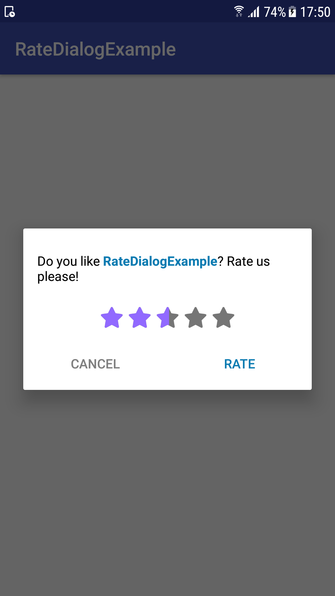
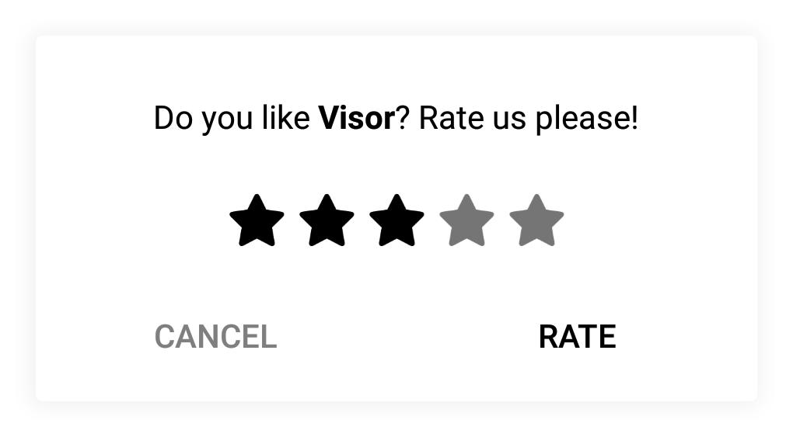
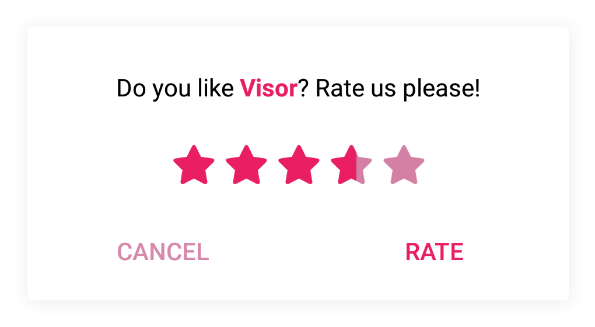
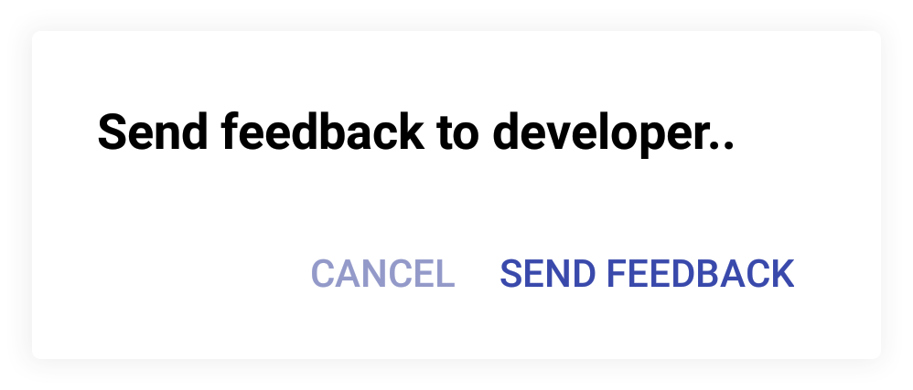

# rate Us Dialog

Customiable RateDialog for any android app.

If User rates 4 or 5, he is navigated to google play.
If he gave you 3 or less - he is navigated to email app, and asked to write a reason of such mark.
Example:

```
 RateDialogHelper rateDialogHelper = new RateDialogHelper.Builder()
                .setRatingColorActive(App.getColorTheme().mainColor)
                .setRatingColorInactive(App.getColorTheme().secondaryColor)
                .setTitleAppNameColor(App.getColorTheme().mainColor)
                .setCancelColor(App.getColorTheme().secondaryColor)
                .setRateColor(App.getColorTheme().mainColor)
                .setFeedbackEmail("developeremail@gmail.com")
                .build();

rateDialogHelper.showRateDialog(this);
```

### Screenshots

<table>
    <col width="50%">
<tr>
  <th width="50%" rowspan="3"> </th>
  <td width="50%"></td>
</tr>
<tr>
  <td></td>
</tr>
 <tr>
 <td></td>
</tr>
</table>

### Integration

Add to your top-level gradle file:

```
allprojects {
    repositories {
        jcenter()

        maven {
            url "https://dl.bintray.com/spartacus777/rateusdialoghelper"
        }
        ...
    }
}
```

Add to app.gradle:
```
compile 'rateusdialoghelper:rateusdialoghelper:1.0.2@aar'
```

### Contract

Call from Application class:

```
RateDialogHelper.onNewSession(context);
```

Call from activity you want the dialog to appear:

```
RateDialogHelper rateDialogHelper = new RateDialogHelper.Builder()
                .setShowEveryTime(true)
                ...
                .build();

rateDialogHelper.showRateDialog(this);
```

## Configurations

RateDialog is UI and functional-configurable.
We use builder pattern to set proper parameters, but, anyway Rate Dialog will work even with default parameters.
So we can specify:
```
setShowEveryTime(boolean b) - show dialog every time, usefull for testing
setAppName(String name) - set App name, that would be displayed in rate us dialog
setFeedbackEmail(String email) - if user press less then 3.1 stars, than he is navigated to email app to send you a review, not google play. You specify an email here

setRatingColorActive(int color) - color of active star
setRatingColorInactive(int color) - color of inactive star
setTitleAppNameColor(int color) - Name of application will be painted in this color
setTitleColor(int color) - rate title dialog color

setCancelColor(int color) - cancel btn color
setRateColor(int color) - rate/send to developer btns colors

setSessionAmount(int sessionAmount) - specify min sessions before dialog shoud be shown
setDayAmount(int day amount) - specify min day amount before dialog shoud be shown
```

## Authors

* **Anton Kizema**

## License

This project is licensed under the Apache 2.0 License - see the [LICENSE.md](LICENSE.md) file for details
You can use this lib as you want. Staring this project would be very encouraging!

